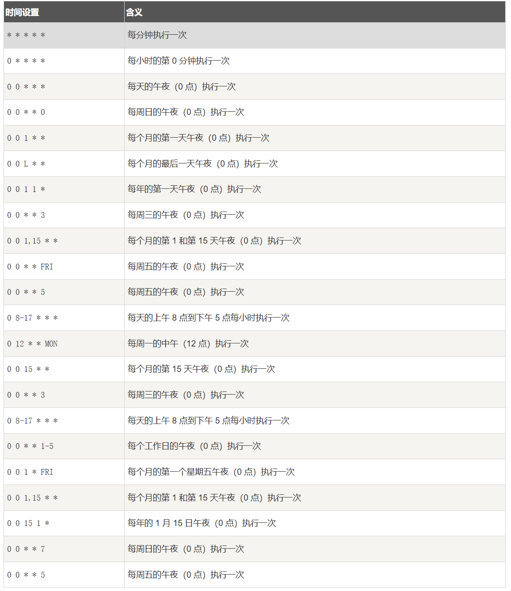

使用本模块实现定时执行任务的方法指南

在模块目录下新建UniCron/模块名.cron文件

模块名.cron参考：

后面的文件路径表示需要定时执行的文件

例如：

不喜欢硬编码，可以echo "$MODDIR" > UniCron.cron

总之方法千千万，你只要放到UniCron/xxx.cron里面，我的前置模块就能读取并添加到列表中

不建议直接echo "cron语句" > data/adb/modules/UniCron/API/cron_tasks/模块名.cron里，你不打算移除了就这样写
